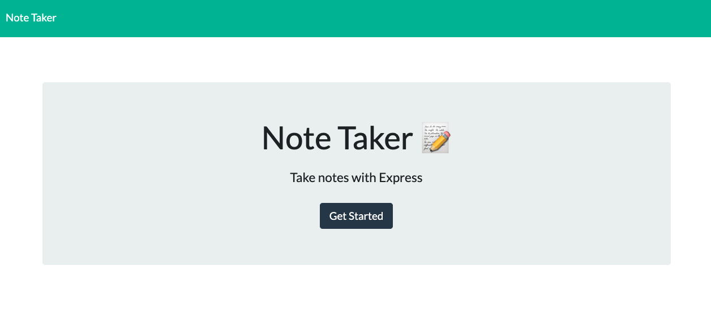

# Note Taker

[LIVE DEMO](https://sheltered-forest-61586.herokuapp.com/)

## Table of Contents

- [Description](#description)
- [Usage](#usage)
- [License](#license)
- [Contact](#contact)

## Description

This app allows the user to quickly recode and save ides in once central spot.

## Usage

Enter a title and body and click the save icon to record a note.

## License

This project (and all code) is licensed under the [MIT license](https://opensource.org/licenses/MIT).

## Contact

If you have any questions feel free to reach out by [email](mailto:sissyhanks@yahoo.com) or visit my [personal website](https://github.com/sissyhanks).
